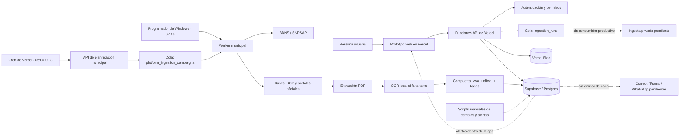

# Arquitectura actual del sistema

Estado comprobado el 13 de julio de 2026. Este documento distingue entre componentes productivos, parciales y de demostración. No describe como operativo aquello que solo existe en la interfaz o en documentos de diseño.

## Resumen ejecutivo

- La interfaz es un prototipo estático servido por Vercel.
- Las funciones `api/*.ts` ejecutan autenticación, permisos, altas, consultas y escrituras breves.
- Supabase/Postgres es la fuente de verdad y contiene dos tablas que actúan como colas.
- Solo la cola de campañas de plataforma tiene hoy un consumidor productivo, limitado al radar municipal BDNS.
- No existe todavía un runtime general de agentes, un orquestador de modelos ni llamadas productivas a un LLM.
- El pipeline municipal es asíncrono, determinista y auditable; combina API, scraping oficial, extracción PDF y OCR local.
- El OCR no es SaaS: se ejecuta en el equipo worker con Tesseract o con el OCR nativo de Windows.
- En producción hay 626 registros, pero solo 42 pasan la compuerta reforzada de convocatoria viva, emisor oficial y bases extraídas.

## Vista gráfica

## Qué es asíncrono y qué no

| Flujo | Cola persistida | Productor | Consumidor | Estado real |
| --- | --- | --- | --- | --- |
| Radar municipal | `platform_ingestion_campaigns` | Cron de Vercel o API de superadministración | `run-municipal-radar.mjs` desde Windows | Productivo |
| Ingesta de fuentes de una entidad | `ingestion_runs` | `POST /api/ingestion-dispatch` | No existe consumidor conectado | Cola preparada, no operativa |
| Alertas por cambios | `tenant_change_alerts.channel_status` | Script manual de impacto | No existe emisor externo | Parcial; solo lectura en la app |
| Paquete documental | No usa cola | Petición web | Función Vercel síncrona | Parcial y bajo revisión humana |
| Conversación de encaje | No usa cola | Navegador | Reglas JavaScript locales | Demostración, sin IA externa |

Una respuesta HTTP `202` significa que el trabajo quedó encolado, no que un agente lo haya terminado. Hoy solo la campaña municipal tiene el ciclo productor-cola-consumidor cerrado.

## Pipeline productivo del radar municipal

1. Vercel invoca diariamente `/api/platform-radar-schedule` con `CRON_SECRET`.
2. La función crea una campaña idempotente `municipal-social:AAAA-MM-DD`.
3. El Programador de tareas de Windows inicia el worker después del cron.
4. El worker reclama una única campaña `queued` y la marca `running`.
5. Consulta BDNS con administración local y cinco búsquedas: acción social, inclusión, empleo, asociaciones y entidades sin ánimo de lucro.
6. Normaliza, deduplica y descarta convenios, ayudas nominativas, expedientes cerrados o plazos inciertos.
7. Descarga documentos oficiales de BDNS y resuelve BOP o portales oficiales cuando la ficha los referencia.
8. Extrae texto con `pypdf`; usa `pdfplumber` como respaldo para PDF problemáticos.
9. Si el PDF es una imagen, usa Tesseract o el OCR nativo de Windows.
10. Solo importa oportunidades abiertas con emisor oficial, bases sustantivas, URL de evidencia y SHA-256.
11. Guarda métricas y salud de fuente, y marca la campaña `completed` o `failed`.

El worker es un proceso determinista. En este momento no consulta un modelo generativo ni envía el texto de las bases a un tercero.

## El OCR no es SaaS

| Pregunta | Respuesta actual |
| --- | --- |
| ¿Se usa una API externa de OCR? | No |
| ¿Dónde se procesa el documento? | En el equipo Windows que ejecuta el worker |
| ¿Motores disponibles? | Tesseract local o OCR nativo de Windows `es-ES` |
| ¿Se ejecuta en Vercel? | No; Vercel solo encola |
| ¿Sale el PDF de nuestro entorno por el OCR? | No |
| Riesgo operativo | El worker depende de que el equipo esté encendido; `StartWhenAvailable` recupera ejecuciones perdidas |

## Estado real de los agentes

“Agente” es el nombre de producto de una capacidad con permisos. No implica que exista un proceso autónomo o un LLM detrás.

| Capacidad | Construcción actual | Automatización | Veredicto |
| --- | --- | --- | --- |
| Búsqueda de convocatorias | Radar municipal completo; búsqueda BDNS general disponible como script | Cron + cola + worker para municipales | Operativo parcial |
| Normalización y revisión de bases | Integrada en el worker municipal con hashes, extracción y OCR | Automática dentro de cada campaña | Operativo para municipales |
| Monitor de cambios | Esquema y script determinista para catálogo privado | Ejecución manual, sin cron productivo | Parcial |
| Investigador de entidad | Flujo, límites de rastreo y consentimiento visibles | No existe worker de rastreo | Prototipo |
| Asistente de encaje | Ranking y conversación local sobre datos cargados | JavaScript en navegador, sin modelo | Prototipo funcional |
| Políticas de datos | RLS, permisos y exclusión de documentos sensibles al trocear | No existe agente de gobierno autónomo | Controles parciales |
| Revisión documental | Reglas locales y API que guarda paquetes Word compatibles | Petición síncrona, sin extracción semántica de agente | Parcial |
| Borrador de memoria | Plantillas y contenido de demostración | Sin modelo ni recuperación privada productiva | Prototipo |
| Avisos y recordatorios | Tablas, watch, generador y API de lectura | Sin ejecución periódica ni envío por canal | Parcial |
| Orquestador de tenants | Autenticación, roles, permisos y aislamiento en APIs/RLS | No coordina agentes ni planes de ejecución | Infraestructura parcial |

Conclusión: hay un pipeline productivo automatizado, varios servicios deterministas parciales y ninguna flota de agentes LLM asíncronos en producción.

## Capacidad de búsqueda comprobada

### Corpus persistido

| Métrica | Cantidad |
| --- | ---: |
| Registros totales | 626 |
| Registros públicos | 614 |
| Registros privados curados | 12 |
| Marcados como abiertos en datos históricos | 65 |
| Vivos y accionables con bases verificadas | 42 |
| Fuentes de plataforma | 14: 2 BDNS y 12 financiadores privados |

Los 23 registros abiertos que no pasan la compuerta actual son legado: 19 públicos sin el nuevo contrato de evidencia y 4 privados sin bases verificadas. No deben presentarse como candidaturas accionables hasta revalidarlos.

### Tipos de las 42 convocatorias accionables

| Tipo BDNS | Cantidad |
| --- | ---: |
| Servicios sociales y promoción social | 13 |
| Fomento del empleo | 11 |
| Educación | 5 |
| Desempleo | 4 |
| Comercio, turismo y pymes | 3 |
| Cultura | 3 |
| Vivienda y edificación | 1 |
| Agricultura, pesca y alimentación | 1 |
| Otras prestaciones económicas | 1 |

Las 42 son de administración local y cubren ayuntamientos, diputaciones, cabildos u otros organismos locales de distintas provincias españolas. La primera campaña examinó 300 detalles: aceptó 42, descartó 258 y no tuvo fallos.

### Qué podemos afirmar y qué no

- Sí podemos buscar convocatorias municipales españolas publicadas en BDNS para las cinco familias sociales configuradas.
- Sí podemos recuperar y verificar bases oficiales en los 42 casos aceptados de la campaña productiva.
- Podemos explorar BDNS general y páginas oficiales privadas con scripts manuales.
- Todavía no hay campaña nacional completa y periódica para todas las palabras, sectores y administraciones.
- Todavía no hay privadas accionables bajo la nueva compuerta, ni cobertura universal de fundaciones.
- La cantidad de resultados no equivale a encaje para una entidad; el encaje por territorio, forma jurídica y actividad sigue necesitando perfil aprobado y revisión humana.

## Almacenamiento y fronteras de confianza

| Espacio | Contenido | Regla |
| --- | --- | --- |
| Plataforma pública | Convocatorias, bases, versiones y evidencias oficiales | Reutilizable entre tenants |
| Tenant privado | Documentos, fragmentos, perfiles y candidaturas de una entidad | Siempre aislado por `tenant_id` |
| Vercel Blob | Ficheros de candidatura generados | La API actual usa acceso público; debe endurecerse antes de almacenar documentación privada real |
| Auditoría | Importaciones, generación documental y acciones | Debe conservar actor, tenant, objeto y evidencia |

En producción hay un documento público listo para procesar y cero fragmentos privados. No existe todavía un índice vectorial privado operativo.

## Ficheros que gobiernan o documentan el proyecto

| Fichero o familia | Título funcional en español | Participación real |
| --- | --- | --- |
| `AGENTS.md` | Reglas de construcción del producto | Instrucciones activas para quien modifica el repositorio; no se despliega como agente |
| `README.md` | Entrada a la documentación | Índice humano principal |
| `docs/architecture/arquitectura-actual-del-sistema.md` | Arquitectura actual del sistema | Documento canónico del estado real |
| `docs/product/master-context.md` | Contexto maestro del producto | Propósito, flujos y fronteras de confianza |
| `docs/product/agentic-architecture.md` | Arquitectura de capacidades agenticas | Contratos y puertas humanas diseñadas |
| `docs/product/data-governance-brief.md` | Gobierno de datos | Clasificación, uso permitido y prohibiciones |
| `docs/product/prd.md` | Requisitos del producto | Alcance y objetivos del MVP |
| `docs/architecture/*.md` | Decisiones de arquitectura | Diseño de RAG, tenants, fuentes, alertas, credenciales y operaciones |
| `docs/security/credentials-and-logging.md` | Credenciales y registro seguro | Normas de secretos y logs |
| `docs/changelog/*.md` | Historial de cambios | Evidencia de intención, ficheros tocados, verificación y riesgos |
| `docs/product/source-evidence-skill.md` | Método de evidencia de fuentes | Documento de metodología; no es una skill ejecutable |

No existe ningún `SKILL.md` dentro del repositorio. Las skills usadas por Codex viven fuera del proyecto y ayudan a construir o revisar; no participan en Vercel, Supabase ni en el runtime del producto:

- `subvenciones-rag-mvp`: límites RAG, fuentes, privacidad y esquema documental.
- `traceable-saas-coding`: cambios pequeños, verificables y auditables.
- `visualize`: reglas para representar la arquitectura gráficamente.

Parte de la documentación histórica conserva títulos y contenido en inglés. Este documento y el nuevo índice son canónicos y están en español. La traducción integral del legado debe hacerse por bloques, conservando rutas y revisando enlaces para no alterar decisiones técnicas.

## Ficheros ejecutables principales

- `vercel.json`: rutas, funciones y cron diario.
- `api/platform-radar-schedule.ts`: productor automático de la cola municipal.
- `api/admin-platform-campaigns.ts`: consulta y alta manual de campañas.
- `api/ingestion-dispatch.ts`: productor de la cola privada aún sin consumidor.
- `scripts/workers/run-municipal-radar.mjs`: consumidor y orquestador del pipeline municipal.
- `scripts/workers/run-municipal-radar-scheduled.ps1`: lanzador local programado.
- `scripts/radar/fetch-bdns-latest.mjs`: consulta y normalización BDNS.
- `scripts/platform/deep-scan-open-funders.mjs`: descarga, extracción y validación de bases.
- `scripts/platform/import-bdns-radar.mjs`: compuerta e importación en Supabase.
- `scripts/workers/extract-public-pdf.py`: extracción de texto y coordinación OCR.
- `scripts/workers/ocr-image-windows.ps1`: OCR local nativo de Windows.
- `supabase/migrations/*.sql`: tablas, RLS, versiones, alertas y colas.

## Decisiones pendientes prioritarias

1. Mover el worker a un host siempre activo o mantener explícitamente la dependencia del PC Windows.
2. Crear el consumidor de `ingestion_runs` antes de ofrecer conectores privados como operativos.
3. Revalidar los 23 registros abiertos heredados o excluirlos de cualquier vista accionable.
4. Ejecutar y programar el monitor de cambios y el generador de alertas.
5. Cambiar los paquetes de candidatura de Blob público a acceso privado con descarga autorizada.
6. Implementar el investigador de entidad con snapshots, consentimiento y aprobación humana.
7. Traducir por bloques la documentación histórica en inglés sin cambiar sus rutas.
