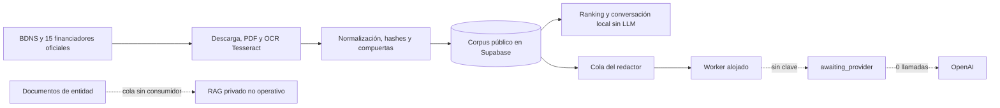
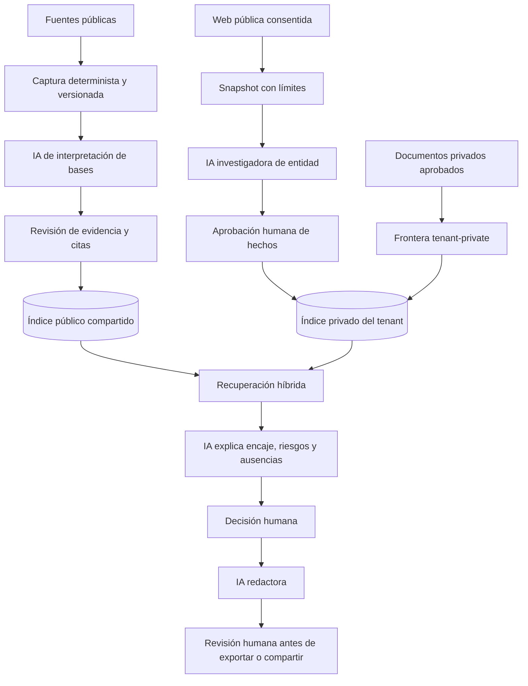

# Participación de IA y RAG

## Respuesta corta

El producto está diseñado como un RAG de subvenciones, pero hoy el RAG semántico todavía no está operativo. La búsqueda, descarga, extracción PDF, OCR, normalización, hashes y compuertas se ejecutan con código determinista. La única integración generativa construida es el redactor de evidencia pública; su worker está alojado, pero no llama a OpenAI porque falta la clave.

Esto no significa que la IA deba limitarse a redactar. La arquitectura objetivo la usa también para interpretar bases, sugerir hechos de entidad y explicar encaje, siempre después de una captura verificable y con revisión humana.

## Arquitectura actual comprobada

## Arquitectura objetivo con IA intensiva y gobernada

## Papel de cada capacidad

| Capacidad | IA actual | IA objetivo | Estado |
| --- | --- | --- | --- |
| Descubrimiento de convocatorias | No; API y rastreo determinista | IA solo clasifica casos dudosos después de capturar evidencia | Operativo sin IA |
| Interpretación de bases | Reglas y extracción de texto | Salida estructurada con requisitos, límites, criterios y citas | Pendiente |
| Investigación de entidad | No existe worker | Analiza snapshots de web pública consentida y propone hechos | Pendiente |
| RAG público | Corpus sin embeddings operativos | Índice vectorial compartido de fuentes públicas versionadas | Pendiente |
| RAG privado | Cola sin consumidor y cero fragmentos privados | Índice separado por `tenant_id`, solo documentos aprobados | Pendiente |
| Encaje | Reglas y conversación JavaScript local | Recuperación híbrida más explicación con evidencias | Prototipo |
| Redacción | API, cola, contrato y worker; 0 llamadas | OpenAI sobre contexto mínimo aprobado | Preparado; falta clave |
| Envíos externos | Ninguno | Adaptadores con aprobación explícita | Bloqueado por diseño |

## Por qué la IA no debe rastrear directamente

El modelo no debe ser quien navegue, descargue y decida qué documento es oficial. Primero se captura la fuente, se guarda URL, versión, hash y texto extraído; después la IA interpreta ese artefacto. Así se puede repetir el análisis, comparar cambios, controlar coste y demostrar de dónde sale cada afirmación.

## Privacidad y coste

- Los vectores públicos se comparten entre tenants; los privados nunca salen de su `tenant_id`.
- La investigación de entidad solo usa web pública con consentimiento y genera sugerencias, no hechos aprobados.
- La interpretación con IA se ejecuta únicamente cuando cambia el hash del documento o una persona la solicita con motivo auditado.
- OpenAI recibe contexto mínimo, `store: false` y ninguna información privada en la fase autorizada.
- El presupuesto del redactor está limitado a 20 € al mes. Los demás usos de IA requieren presupuesto y contrato propios antes de activarse.

## Orden de construcción recomendado

1. Consumidor de `ingestion_runs` e índice privado aislado.
2. Interpretador de bases con JSON estricto, citas y revisión humana.
3. Investigador de entidad sobre snapshots consentidos.
4. Recuperación híbrida pública/privada y encaje explicable.
5. Activación del redactor con clave, prueba real y monitor de coste.
